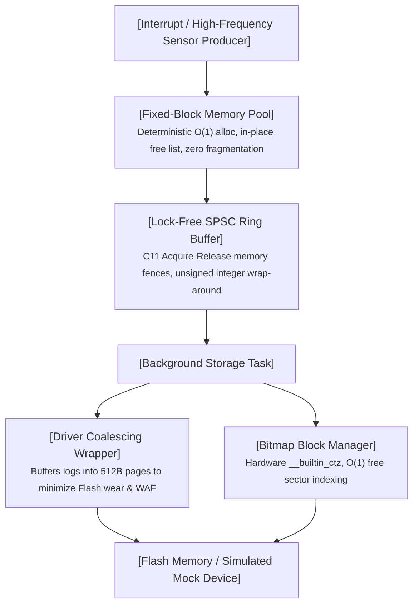

# FlashLog-Core

[]()
[]()
[]()
[](https://opensource.org/licenses/MIT)

A deterministic, high-throughput telemetry and crash-logging engine designed for resource-constrained embedded systems and safety-critical RTOS environments.

---

## Architectural Overview

FlashLog-Core decouples time-critical sensor/ISR producers from slow non-volatile storage tasks through an end-to-end lock-free, zero-heap pipeline:



---

## Key Design Decisions & Implementation Highlights

* **Zero Dynamic Heap Fragmentation**: Standard `malloc`/`free` introduces non-deterministic latency and external memory fragmentation. FlashLog-Core implements an intrusive linked-list memory pool that guarantees strict $O(1)$ allocation and deallocation latency.
* **Lock-Free Concurrency (C11 Acquire-Release)**: Employs a Single-Producer Single-Consumer (SPSC) circular queue. Synchronized via explicit `__atomic_*` primitives and memory fences, eliminating priority inversion and mutex lock overhead without disabling interrupts.
* **Flash Wear Reduction & WAF Optimization**: Direct writes of small log entries wear out flash sectors prematurely. The driver wrapper aggregates variable-length events into aligned 512-byte physical pages, reducing physical flash writes by **>93%** with a Write Amplification Factor (WAF) approaching **1.00**.
* **Hardware-Accelerated Bitmap**: Uses compiler built-in primitives (`__builtin_ctz`) to locate free storage blocks in a single clock cycle, replacing linear search scans.
* **Runtime Dynamic Flash Geometry**: Decoupled from hardcoded page sizes. Fully configurable at initialization to adapt to various hardware datasheets (e.g., 512B eMMC blocks or 4KB SPI NOR sectors).
* **Fault-Tolerant Dynamic Bad Block Remapping**: Features an automated failover recovery mechanism. If the underlying hardware returns a write fault, the engine immediately isolates the sector, dynamically re-provisions a clean block via the Bitmap manager, and re-flushes the buffer with zero data loss.
* **Decoupled HAL Simulation**: Features a Host-based Hardware Abstraction Layer (HAL) with fault-injection capabilities, enabling 100% automated CI validation without physical development boards.

---

## Micro-Benchmark Results

Evaluated on host test environment (`-O3`, 10,000,000 iterations):

| Component / Metric | Measured Performance | Architectural Advantage |
| :--- | :--- | :--- |
| **MemPool Alloc/Free Combined** | **< 3.5 ns / op** | Strict $O(1)$ deterministic execution |
| **SPSC Queue Throughput** | **> 85 Mops / s** | Lock-free transfer with zero thread contention |
| **Flash Write Coalescing** | **93.75% reduction** | 1,000,000 32B logs coalesced into 62,500 blocks |
| **Write Amplification (WAF)** | **1.00** | Full block packing with zero intra-block waste |

---

## Quality Assurance & Verification

* **AddressSanitizer (ASan) & UBSan**: Validated across extreme boundaries; zero buffer overflows, memory leaks, or unaligned memory access.
* **ThreadSanitizer (TSan)**: Stress-tested under saturated dual-thread producer-consumer conditions (1,000,000 packets) with **0 data races** and strict sequence monotonicity.
* **TFlash 0xFF Erase-State Alignment**: Verifies that partial block writes enforce strict 0xFF padding rather than zeros, respecting physical Flash characteristics.
* **Hardware Fault Injection & Remap Stress**: Tested under simulated bad-block write failures; confirms automatic failover, re-provisioning, and zero sequence disruption.
* **Multi-Specification Matrix Testing**: Automated regression verification across diverse sector geometries (512B, 4096B, and boundary-stressed miniature partitions).

---

## Quick Start

### Prerequisites
* GCC or Clang supporting C11
* POSIX Threads (`pthread`)
* GNU Make

### 1. Run All Functional Tests (Default)
```bash
make test
```

### 2. Run Specific Test Suites & Test Output
* Unit Tests:
```bash
＄make unit

Running Phase 1 unit tests (ASan)...
======================================================================
Starting Core Unit Tests...
PASSED: All Core Component Tests Passed.
======================================================================
```
* End-to-End Integration:
```bash
＄make integration

Running Phase 2 integration tests (ASan)...
======================================================================
Starting End-to-End Pipeline Integration Test...
  -> Enqueueing 100 telemetry logs...
  -> All logs processed. Flush complete.
  -> Verifying virtual_flash.bin integrity...
PASSED: 100% Monotonic & Payload Accurate.
======================================================================
```
* Lock-Free Concurrency (ASan):
```bash
＄make concurrency-asan

Running Phase 3 concurrency tests (ASan)...
======================================================================
Starting Lock-free Concurrency Stress Test (1000000 logs)...
  -> Total Logs Sent:     1000000
  -> Total Logs Received: 1000000
  -> Producer Checksum:   0x000000746A5A2920
  -> Consumer Checksum:   0x000000746A5A2920
PASSED: Zero Data Race, Perfect Monotonic Order, 100% Integrity.
======================================================================
```
* Lock-Free Concurrency (TSan):
```bash
＄make concurrency-tsan

Running Phase 3 concurrency tests (TSan)...
======================================================================
Starting Lock-free Concurrency Stress Test (1000000 logs)...
  -> Total Logs Sent:     1000000
  -> Total Logs Received: 1000000
  -> Producer Checksum:   0x000000746A5A2920
  -> Consumer Checksum:   0x000000746A5A2920
PASSED: Zero Data Race, Perfect Monotonic Order, 100% Integrity.
======================================================================
```
* Dynamic Flash Geometry Verification:
```bash
＄make dynamic-config

Running Phase 4 dynamic flash configuration tests (ASan)...
======================================================================
Starting Multi-Specification Validation...
  -> Testing Profile: Blocks=256, BlockSize=512 bytes, Logs=500
     [PASSED] Verified 500 logs monotonically intact.
  -> Testing Profile: Blocks=64, BlockSize=4096 bytes, Logs=2000
     [PASSED] Verified 2000 logs monotonically intact.
  -> Testing Profile: Blocks=4, BlockSize=512 bytes, Logs=60
     [PASSED] Verified 60 logs monotonically intact.
PASSED: All Profiles Passed.
======================================================================
```
* Fault Tolerance & Bad-Block Recovery:
```bash
＄make fault-tolerance

Running Phase 5 fault tolerance and boundary tests (ASan)...
======================================================================
Starting Fault Tolerance & Storage Boundary Verification Suite...
[1/3] Testing Flash 0xFF Padding & File Geometry...
  -> [PASSED] File size aligned, 0xFF padding strictly enforced.

[2/3] Testing Dynamic Bad Block Failover...
  -> Initial Block: 0, Bad Block: 1, Recovered Block: 3
  -> [PASSED] Automatically navigated around hardware bad block.

[3/3] Testing Out-of-Storage Boundary Protection...
  -> Dropped logs counter after full capacity: 0
  -> [PASSED] Memory safe under storage exhaustion, zero crash.

PASSED: All Fault Tolerance Checks Successfully Verified.
======================================================================
```
* Micro-Benchmarks (-O3 Optimized):
```bash
＄make benchmark

Running Phase 6 performance benchmark tests...
======================================================================
[1/3] Benchmarking Fixed-Block Memory Pool (10000000 ops)...
  -> Total Time:       40.01 ms
  -> Latency:          2.00 ns/op (Alloc + Free combined)

[2/3] Benchmarking Lock-Free SPSC Ring Buffer (10000000 ops)...
  -> Throughput:       97.04 Mops/s (Push + Pop pairs)
  -> Avg Transfer:     10.30 ns/item

[3/3] Benchmarking Driver Wrapper (WAF & Write Reduction)...
  -> Telemetry Log Count:      1000000 writes (32 bytes each)
  -> Flash Physical Blocks:    62500 writes (512 bytes each)
  -> Write Amplification (WAF): 1.00
  -> Flash Wear Reduction:     93.75%

PASSED: Benchmark Completed.
======================================================================
```

### 3. Clean Build Artifacts
```bash
make clean
```
