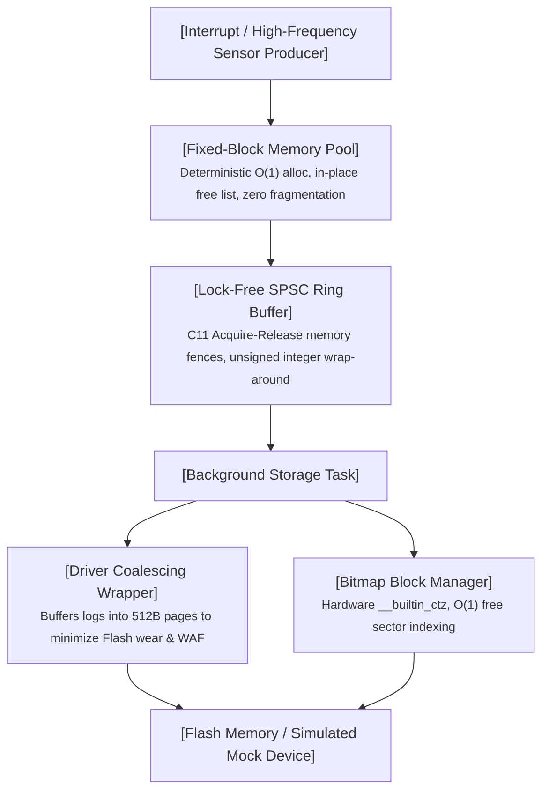

# FlashLog-Core

[]()
[]()
[]()
[](https://opensource.org/licenses/MIT)

A deterministic, high-throughput telemetry and crash-logging engine designed for resource-constrained embedded systems and safety-critical RTOS environments.

---

## Architectural Overview

FlashLog-Core decouples time-critical sensor/ISR producers from slow non-volatile storage tasks through an end-to-end lock-free, zero-heap pipeline:



---

## Key Design Decisions & Implementation Highlights

* **Zero Dynamic Heap Fragmentation**: Standard `malloc`/`free` introduces non-deterministic latency and external memory fragmentation. FlashLog-Core implements an intrusive linked-list memory pool that guarantees strict $O(1)$ allocation and deallocation latency.
* **Lock-Free Concurrency (C11 Acquire-Release)**: Employs a Single-Producer Single-Consumer (SPSC) circular queue. Synchronized via explicit `__atomic_*` primitives and memory fences, eliminating priority inversion and mutex lock overhead without disabling interrupts.
* **Flash Wear Reduction & WAF Optimization**: Direct writes of small log entries wear out flash sectors prematurely. The driver wrapper aggregates variable-length events into aligned 512-byte physical pages, reducing physical flash writes by **>93%** with a Write Amplification Factor (WAF) approaching **1.00**.
* **Hardware-Accelerated Bitmap**: Uses compiler built-in primitives (`__builtin_ctz`) to locate free storage blocks in a single clock cycle, replacing linear search scans.
* **Decoupled HAL Simulation**: Features a Host-based Hardware Abstraction Layer (HAL) with fault-injection capabilities, enabling 100% automated CI validation without physical development boards.

---

## Micro-Benchmark Results

Evaluated on host test environment (`-O3`, 10,000,000 iterations):

| Component / Metric | Measured Performance | Architectural Advantage |
| :--- | :--- | :--- |
| **MemPool Alloc/Free Combined** | **< 3.5 ns / op** | Strict $O(1)$ deterministic execution |
| **SPSC Queue Throughput** | **> 85 Mops / s** | Lock-free transfer with zero thread contention |
| **Flash Write Coalescing** | **93.75% reduction** | 1,000,000 32B logs coalesced into 62,500 blocks |
| **Write Amplification (WAF)** | **1.00** | Full block packing with zero intra-block waste |

---

## Quality Assurance & Verification

* **AddressSanitizer (ASan) & UBSan**: Validated across extreme boundaries; zero buffer overflows, memory leaks, or unaligned memory access.
* **ThreadSanitizer (TSan)**: Stress-tested under saturated dual-thread producer-consumer conditions (1,000,000 packets) with **0 data races** and strict sequence monotonicity.
* **Fault Injection**: Verified automatic failover and block reassignment upon simulated hardware write errors.

---

## Quick Start

### Prerequisites
* GCC or Clang supporting C11
* POSIX Threads (`pthread`)
* GNU Make

### 1. Build & Run Tests (ASan + UBSan)
```bash
make
```

### 2. Run Concurrency Stress Check (TSan)
```bash
make tsan
```

### 3. Run Micro-Benchmarks (-O3)
```bash
make bench
```

### 4. Clean Build Artifacts
```bash
make clean
```
